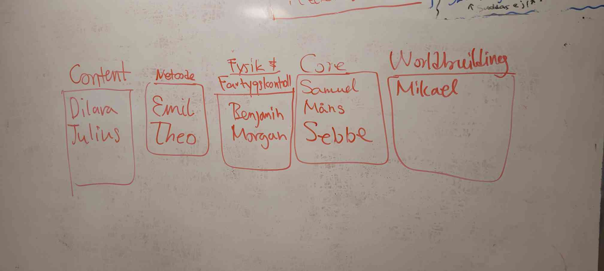

# .github
The README for the T4Studios organization

# Groups
We have divided the class into some groups that take care of different areas. These are the groups:

## The groups are the following:
* Worldbuilding (markets, terrain gen, travel)
    - [Mikael](https://github.com/0n10n7)

* Core (project masters, coordinators)
    - [Samuel](https://github.com/samstroyer)
    - [Måns](https://github.com/fyrgeit)
    - [Sebbe](https://github.com/seb-jen-dev)

* Fysics (movement, sailing, weather)
    - [Benjamin](https://github.com/Ruby1405)
    - [Morgan](https://github.com/BOT-Mojjo)

* Networking (packets, dedicated server - client communication)
    - [Theo](https://github.com/zibbe77)
    - [Emil](https://github.com/emilpoppler134)

* Content (models, ingame chats)
    - [Dilara](https://github.com/didgeridoogan)
    - [Julius](https://github.com/Julius011)

* UI (design, user experience)
    - [Paul](https://github.com/Deathstructor)

# Goal 
We want to create a game in C, only having 3 days of active coding. This project was setup so there are no hinders on the actual code-days. 